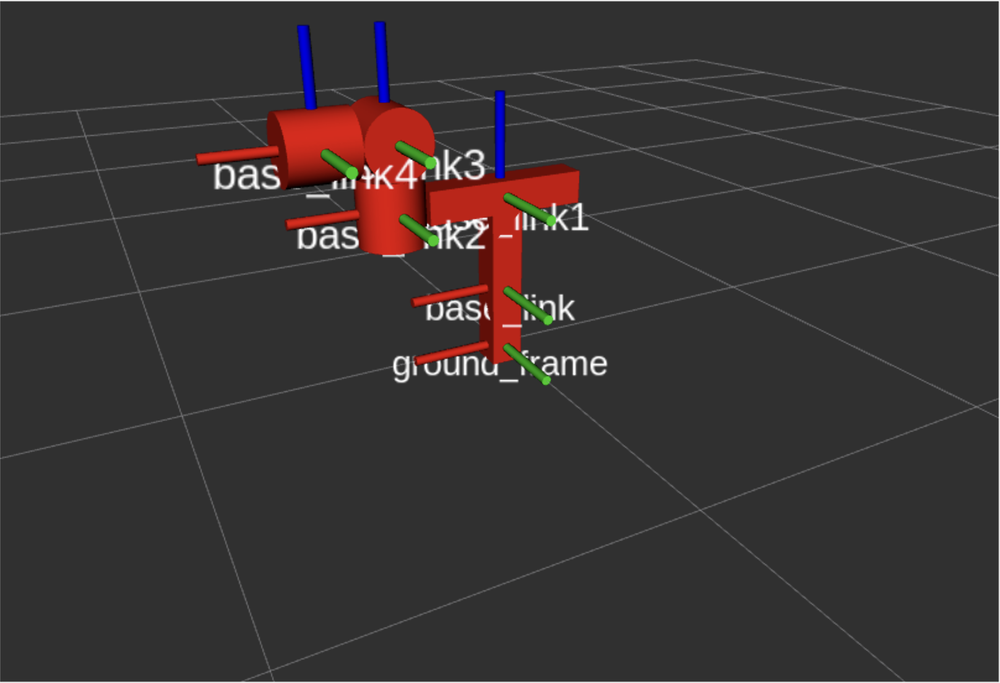

# Assignment 2

- [Assignment 2](#assignment-2)
  - [Current configuration - ZXZYX](#current-configuration---zxzyx)
  - [Mechanism Characteristics](#mechanism-characteristics)
  - [Frame Assignments](#frame-assignments)
  - [Forward Kinematics](#forward-kinematics)

## Current configuration - ZXZYX

Even though it was not required by an assignment to create a spherical wrist out of revolute joints, after a brief discussion with the TA it seems that it is just slightly better. Therefore I have decided to fix my configuration to suit this recommendation.

## Mechanism Characteristics

1. **Translational Z**: 0.1 x 0.1 x 0.5
2. **Translational X**: 0.1 x 0.1 x 0.5
3. **Revolute Z**: l = 0.2, r = 0.1
4. **Revolute Y**: l = 0.2, r = 0.1
5. **Revolute X**: l = 0.2, r = 0.1

## Frame Assignments

Frame assignments are as shown on the picture above - **red** axis is **oX**, green is **oY** and blue is **oZ**. Some clarifications: all the frames perfectly aligned with the centers of links of the mechanism. Moreover, all axes are coaligned (in initial state). Given that the ground frame is the frame 0, the frame 1 is the frame of the first link, frame 2 is the frame of the second link and so on.

## Forward Kinematics

We have 5 links mechanism, so we need 5 transformations. First one is a transformation from the base frame to the first link frame. It is a simple translation along the **oZ** axis by **q1** units. Second transformation is a translation along **oX** axis by **q2** units. Third transformation is a rotation around **oZ** axis by **q3** units. Fourth transformation is a rotation around **oY** axis by **q4**. Fifth transformation is a rotation around **oX** axis by **q5** units. Therefore, given height, width and length as well as radius of the links, we can calculate the transformation matrix as follows:

$$T = T^0_1 \cdot T^1_2 \cdot T^2_3 \cdot T^3_4 \cdot T^4_5$$
Where:

$$T^0_1 = T_z(q1)$$

$$T^1_2 = T_z(\frac{h_1}{2} + \frac{w_2}{2}) \cdot T_x(q2)$$

$$T^2_3 = T_x(\frac{h_2}{2} + r_3)\cdot R_z(q3)$$

$$T^3_4 = T_z(\frac{l_3}{2} + r_4) \cdot R_y(q4)$$

$$T^4_5 = T_x(r_4 + \frac{l_5}{2})\cdot R_x(q5)$$

$$
T = 
\left[\begin{matrix}\cos{\left(q_{3} \right)} \cos{\left(q_{4} \right)} & - \sin{\left(q_{3} \right)} \cos{\left(q_{5} \right)} + \sin{\left(q_{4} \right)} \sin{\left(q_{5} \right)} \cos{\left(q_{3} \right)} & \sin{\left(q_{3} \right)} \sin{\left(q_{5} \right)} + \sin{\left(q_{4} \right)} \cos{\left(q_{3} \right)} \cos{\left(q_{5} \right)} & \frac{h_{2}}{2} + q_{2} + r_{3} + \left(\frac{l_{5}}{2} + r_{4}\right) \cos{\left(q_{3} \right)} \cos{\left(q_{4} \right)}\\\sin{\left(q_{3} \right)} \cos{\left(q_{4} \right)} & \sin{\left(q_{3} \right)} \sin{\left(q_{4} \right)} \sin{\left(q_{5} \right)} + \cos{\left(q_{3} \right)} \cos{\left(q_{5} \right)} & \sin{\left(q_{3} \right)} \sin{\left(q_{4} \right)} \cos{\left(q_{5} \right)} - \sin{\left(q_{5} \right)} \cos{\left(q_{3} \right)} & \left(\frac{l_{5}}{2} + r_{4}\right) \sin{\left(q_{3} \right)} \cos{\left(q_{4} \right)}\\ 
-\sin{\left(q_{4} \right)} & \sin{\left(q_{5} \right)} \cos{\left(q_{4} \right)} & \cos{\left(q_{4} \right)} \cos{\left(q_{5} \right)} & \frac{h_{1}}{2} + \frac{l_{3}}{2} + q_{1} + r_{4} + \frac{w_{2}}{2} - \frac{\left(l_{5} + 2 r_{4}\right) \sin{\left(q_{4} \right)}}{2}\\ 
0 & 0 & 0 & 1\end{matrix}\right]
$$