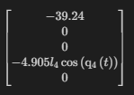
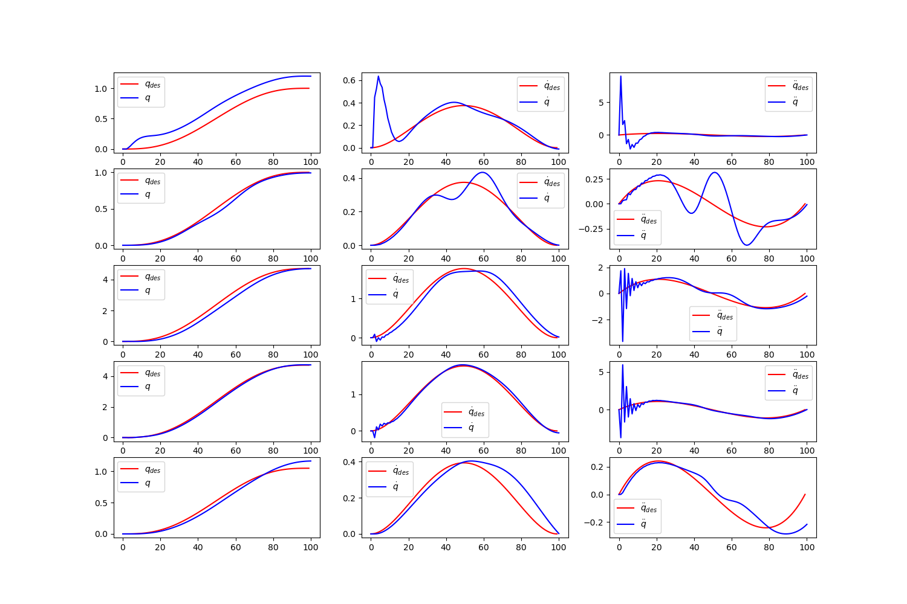
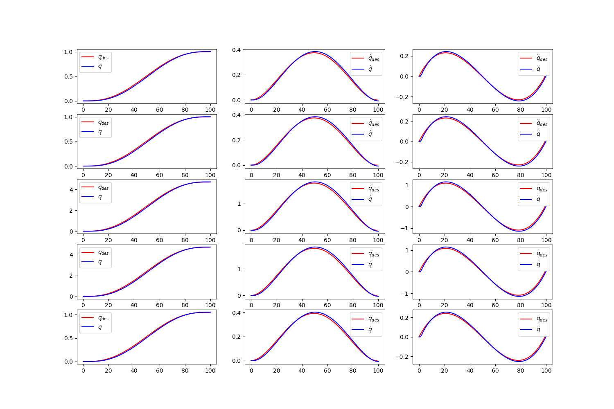
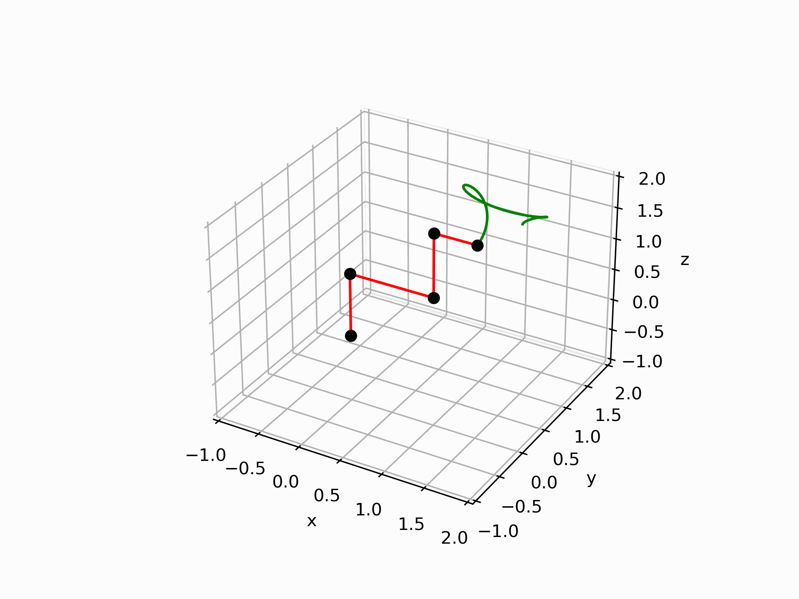

# Assignment 3

- [Assignment 3](#assignment-3)
  - [Assignment Code](#assignment-code)
  - [Current configuration - ZXZYX](#current-configuration---zxzyx)
  - [Mechanism Characteristics](#mechanism-characteristics)
  - [Frame Assignments](#frame-assignments)
  - [DH-Table](#dh-table)
  - [Forward Kinematics and Centers of Mass](#forward-kinematics-and-centers-of-mass)
  - [Jacobians](#jacobians)
  - [Dynamic Model Derivation](#dynamic-model-derivation)
    - [Inertia](#inertia)
    - [Coriolis](#coriolis)
    - [Gravity](#gravity)
  - [Trajectory planning](#trajectory-planning)
    - [Trajectory](#trajectory)
    - [Polynomial](#polynomial)
    - [Implementation](#implementation)
  - [Control](#control)
    - [First try](#first-try)
    - [Second try](#second-try)
  - [Simulation](#simulation)
    - [First control strategy](#first-control-strategy)
    - [Second control strategy](#second-control-strategy)
    - [Control comparison](#control-comparison)
  - [Conclusion](#conclusion)

## Assignment Code

All the code used in the assignment can be found in the project notebook [here](solution.ipynb).

## Current configuration - ZXZYX

## Mechanism Characteristics

For the sake of simplicity, during the calculations we will use masses of all the links equal to 1, their lengths will be equal to 1 as well.

## Frame Assignments

## DH-Table

I want to clarify that even though I write the parameters in the unconventional way inside the table, I still use them conventionally while calculating the tranformations.

| Joints | a                | alpha    | d | theta   |
|--------|------------------|----------|---|---------|
| 1      | 0                | 0        | 0 | 0       |
| 2      | pi / 2           | pi / 2   | 0 | d1 + l1 |
| 3      | 0                | - pi / 2 | 0 | d2 + l2 |
| 4      | -pi / 2 + theta1 | pi / 2   | 0 | l3      |
| 5      | pi / 2 + theta2  | pi /  2  | 0 | 0       |
| 6      | theta3           | 0        | 0 | l4      |

## Forward Kinematics and Centers of Mass

I will assume that it is not required to explain detailed how the forward kinematics is derived, since we have done this in the previous assignment. However, I will explain the frame assignment and the way I derived the centers of mass.

From the frame assignment we can see that the center of mass of the links are located almost always at the origin of the link.With the only exception we will deal with simple translation along actuation axis. Moreover, I will assume that CoMs don't change their position relatively to the parent frame during the actuation of a corresponding joint.

## Jacobians

One of the main unobvious advantages of my frame assignment is the calculation of jacobians. Since CoMs almost always align with the origin of the frame, we can simply use the same jacobian derivation as in the previous assignment. The only difference is the last revolute joint. However, its jacobian is very simple and can be easily derived, since axis of rotation can be derived from the forward kinematics as well.

## Dynamic Model Derivation

We will be using the matrix form of Euler-Lagrange dynamic model for mechanical system defined as:

$$
M(q) \ddot{q} + C(q, \dot{q}) \dot{q} + g(q) = \tau
$$

We have to derive three components of the system: **Inertia**, **Coriolis** and **Gravity**.

### Inertia

* The first problem we have is to find inertia tensor. Since we are free to assume any, I will use a simple one and solve in general case to be able to substitute it with any other. 
* Secondly we should find all consequtive rotation transformations. We can do it by using the forward kinematics as well.

Finally we can derive the inertia by simply substituting the corresponding values. Since I am solving in a general case, my inertia is symbolical. We have to check whether it is symmetric and positive definite.

* Checking for symmetry is easy, since we have to check whether $M_{ij} = M_{ji}$ for all $i,j$. We have just simplify the matrix and check whether the assertion holds.
* Checking for definiteness is a bit more complicated. We need several steps to do it. First of all, since our matrix is symmetric (we have checked it before), we can use the eigenvalues to check whether it is positive definite. Secondly, our matrix is symbolical, therefore we can not find exact values of eigenvalues. One of the approaches is to generate various number of random samples, substitute them instead of symbols and calculate eigenvalues. This approach successfuly proven the assumption.

### Coriolis

Coriolis is even easier. We have simply follow the formula by calculating Christoffel symbols and substituting the inertia.

$$
c_{ijk} = \frac{1}{2} \left( \frac{\partial M_{ij}}{\partial q_k} + \frac{\partial M_{ik}}{\partial q_j} - \frac{\partial M_{jk}}{\partial q_i} \right)
$$

Result is as follows:

### Gravity

Gravity is a one-liner as well. Moreover, we can easilly check whether it is correct by logically checking the values.

$$
g = \sum (J_{v_i}^k)^T m_k g
$$

Result is as follows:

As we can see, our first translational joint is negatively affected by the gravity. Moreover, this effect is constant, which seems to be true, since our joint movement is along the gravity axis and in the opposite direction.

Moreover, our fourth joint rotation is affected as the function of the angle. This is reasonable as well, since the gravity is acting perpendicular to the axis of rotation.

## Trajectory planning

### Trajectory

First of all, we have to define the trajectory. I have defined it in the following way:

$$q_1 = 1$$

$$q_2 = 1$$

$$q_3 = \frac{3 \pi}{2}$$

$$q_4 = \frac{3 \pi}{2}$$

$$q_5 = \frac{\pi}{3}$$

With this configuration revolute joints will have almost the full circle rotation, the last joint movement will be hard to visualize, so an angle is just for control and the translational joint will move along the actuation axis only on 1 unit.

### Polynomial

Secondly, we have to determine the degree of a polynomial. We have the following constraints: $q_0, q_f, \dot{q}_0, \dot{q}_f, \ddot{q_0}, \ddot{q_f}$

In other words, we have 6 constraints, therefore we would need 6 coefficients, i.e. 5th degree polynomial.

$$
\begin{equation}
\begin{cases}
q_0 = a_5 t_f^5 + a_4 t_f^4 + a_3 t_f^3 + a_2 t_f^2 + a_1 t_f + a_0\\
q_f = a_5 t_0^5 + a_4 t_0^4 + a_3 t_0^3 + a_2 t_0^2 + a_1 t_0 + a_0\\
\dot{q}_0 = 5 a_5 t_f^4 + 4 a_4 t_f^3 + 3 a_3 t_f^2 + 2 a_2 t_f + a_1\\
\dot{q}_f = 5 a_5 t_0^4 + 4 a_4 t_0^3 + 3 a_3 t_0^2 + 2 a_2 t_0 + a_1\\
\ddot{q}_0 = 20 a_5 t_f^3 + 12 a_4 t_f^2 + 6 a_3 t_f + 2 a_2\\
\ddot{q}_f = 20 a_5 t_0^3 + 12 a_4 t_0^2 + 6 a_3 t_0 + 2 a_2
\end{cases}
\end{equation}
$$

### Implementation

Solving constraints system defined above we will get all the needed coefficients for each of the joints. Substituting them into the polynomial we will calculate desired trajectories:

$$
\begin{equation}
\begin{cases}
q(t) = a_5 t^5 + a_4 t^4 + a_3 t^3 + a_2 t^2 + a_1 t + a_0\\
\dot{q}(t) = 5 a_5 t^4 + 4 a_4 t^3 + 3 a_3 t^2 + 2 a_2 t + a_1\\
\ddot{q}(t) = 20 a_5 t^3 + 12 a_4 t^2 + 6 a_3 t + 2 a_2
\end{cases}
\end{equation}
$$

## Control

After the easiest part (calculation of dynamics) is done, we have to implement the control. 

Both tries share the way of calculating current position and the velocity.
Let's assume we have correct $q_i, \dot{q_i}, \ddot{q_i}$ at the moment of time $t_i$. How do we make a change to $q_{i+1}, \dot{q_{i + 1}}, \ddot{q_{i + 1}}$? It happens this way, that the change in velocity can be calculated through the previous acceleration: $\dot{q_{i + 1}} = \dot{q_i} + \ddot{q_i} \cdot dt$. In the same manner we know the current position. The only thing we have to do is to calculate the acceleration.

$$
\ddot{q} = M^{-1} \left( \tau - C \dot{q} - g(q) \right)
$$

### First try

I have slightly misunderstood the assignment, so initially I have implemented the control without linearization in the following manner:

$$
\tau = K_p \left( q_d - q \right) + K_d \left( \dot{q}_d - \dot{q} \right)
$$

The issue with this control is that our system is dependent on the proportional and differential controllers in non-linear manner. It makes very difficult to construct the controller in the manner that all the joints requirenments would be satisfied. To show the evolution of the system I have decided to keep the results and compare them with the right control.

As we can see, I have barely managed to approach stable and accurate control of the system even though I have spent considerable amount of time on tuning the parameters.

### Second try

Now we will implement appropriate control. The main idea of this method is to put the whole dynamics of the system into the controller. 

$$
\tau = M u_q + C \dot{q} + g(q)
$$

As a result of this control we get

$$
\ddot{q} = u_q
$$

We are controlling the whole system by controlling only the acceleration of the joints. This incredibly simple control gives outstanding results comparing to the previous approach. Moreover, it almost did not require any tuning of the parameters.

## Simulation

For the sake of simplicity I have simulated the positions of the CoMs of the system. Black points is the CoMs themselves. Red lines show relations between adjacent CoMs. The blue dotted line is the trajectory of the end-effector. Green line is desired end effector trajectory.

### First control strategy

### Second control strategy

### Control comparison

As we can see, the second approach is incredibly better. First of all, it follows accurately the desired trajectory without any issues, while error in the first strategy is huge. Secondly we can notice differences in control strategy itself. The first strategy is very jerky, with bad accelerations and velocities, while the second one is smooth and accurate, following the desired polynomial functions.

## Conclusion

As we can see, Matrix form of Euler-Lagrange dynamic model is very convenient and easy way to represent a complex mechanical system. It does not take long to calculate the components and it allows a general form. 

Moreover, using this equation we can numerically simulate our system and control it. Specifying the desired trajectory we can easily control the system with various approaches.

Also we were able to analyze and compare the two control strategies. The second was not harder to implement, but it was much more effective. Moreover, it did not require a lot of parameter tuning.

